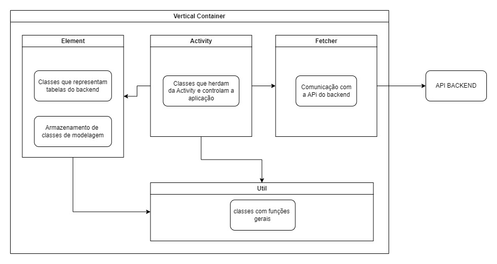

# Mobile Challenge by MAI

# Sobre
O projeto faz parte de uma solução criada para o challenge, a parte desenvolvida é um aplicativo \
que está sendo desenvolvido para a empresa que fizer uma assinatura com a MAI para integrarmos \
nossos serviços à sua plataforma. \
A finalidade deste app é criar um ambiente de facil acesso à empresa onde ela pode ver e analizar dados que coletarmos \
sobre a sua aplicação com a integração dos com a nossa empresa.

# Gigrama da Arquitetura do projeto

# Tecnologias Usadas

- kotlin
- android studio
- okhttp
- Gson
